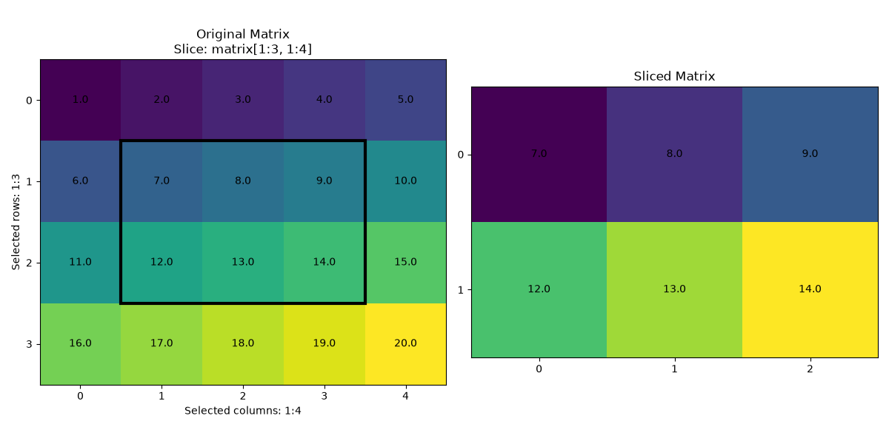

# Task 4 — 2D Matrix Slicing

## Introduction
This task implements two-dimensional matrix slicing using two approaches: **NumPy in Python** and **C++**. Both implementations allow the user to enter the matrix size, matrix values and the row and column boundaries of the slice. The NumPy implementation uses 2D slicing syntax while C++ implemetation performs manually the same operation using loops. The results of both implementations are compared using the same input and graphical image is used to show selected part of the original matrix and the resulting slice.

## Implementation

### NumPy Implementation
In the NumPy implementation, the user enters the number of rows and columns and then enters the matrix values. The program also asks for the starting and ending row indexes and column indexes. Before slicing, the program checks that matrix dimensions are positive and slice boundaries are valid.

The slicing is performed using
```python
sliced_matrix = matrix[row_start:row_end, col_start:col_end]
```
Python indexing starts from 0 and the ending indexes are excluded from the slice.

### C++ Implementation
The C++ implementation uses `vector<vector<double>>` to store the matrix dynamically. The user enters the matrix dimensions, values and the row and column boundaries of the slice. Before slicing, the program checks that the matrix dimesions are positive and slice boundaries are valid.
The sliced matrix is created manually using two loops. The outer loop selects the required rows and the inner loop selects the required columns. The ending row and column indexes are excluded so that the C++ implementation follows the same slicing behavior as NumPy.

## Graphical Result

The same input was used for both the NumPy and C++ implementations.

The input matrix was:

```text
1  2  3  4  5
6  7  8  9  10
11 12 13 14 15
16 17 18 19 20
```
The selected slice boundaries were:
Rows: 1:3
Columns: 1:4

Both implementations produced the same sliced matrix:
```text
7  8  9
12 13 14
```
The graphical image was generated using `matrix_slice_visualization.py`. The program uses Matplotlib to display the original matrix, highlight the selected rows and columns and show the resulting sliced matrix.

Image shows the selected part of the original matrix and the resulting sliced matrix.



## ChatGPT Implementation and Prompting
After completing my own implementation, I asked ChatGPT to implement the same 2D matrix slicing task using NumPy and C++. ChatGPT solved the problem by using NumPy 2D slicing in the Python implementation and nested loops in the C++ implementation to reproduce the same slicing behavior. It also added validation for positive matrix dimensions and valid slice boundaries before performing the slicing. In my prompt for task 3, I specified that matrix dimensions and values should be entered by the user. So, this time ChatGPT added the necessary validations and dynamic inputs by itself without requiring an additional prompt. After reviewing the first solution I asked ChatGPT to also show the results graphically using the same input and slice boundaries for both implementations. ChatGPT then suggested comparing the original matrix, the NumPy result and the C++ result visually so that it would be easy to verify that both implemetations produced the same output. The prompting process led ChatGPT from the implementation of the slicing operation to the graphical comparison required by the task.

ChatGPT conversation:  
https://chatgpt.com/share/6ac514d1-0db4-83ed-8275-fae309113ff0

## How to Run

The NumPy and C++ implementations can be run from the `task4/code` directory. The graphical visualization should be run from the `task4` directory.

### NumPy Implementation
Install NumPy:
```powershell
pip install numpy
```
Then run:
```powershell
python matrix_slice_numpy.py
```

### C++ Implementation
Compile the C++ program:
```powershell
g++ matrix_slice_cpp.cpp -o matrix_slice_cpp
.\matrix_slice_cpp.exe
```

### Graphical Visualization
Install Matplotlib:
```powershell
pip install matplotlib
```
Run the visualization from the task4 directory:
```powershell
python code/matrix_slice_visualization.py
```

## Conclusion
In this task, 2D matrix slicing was implemented using NumPy and C++. Both implementations allow the user to enter the matrix dimensions, matrix values and slice boundaries. NumPy implementation performs slicing directly using 2D slicing syntax while C++ implementtion reproduces the same behavior manually using nested loops. Both implementations were tested with the same input and produced the same sliced matrix. Graphical representation was also created to show selected part of the original matrix and the resulting slice. This made it easier to compare the results and confirm that both approaches produced the same output.

## References
Matplotlib Development Team. (n.d.). *imshow — Display data as an image*.  
https://matplotlib.org/stable/plot_types/arrays/imshow.html

Matplotlib Development Team. (n.d.). *matplotlib.patches.Rectangle*.  
https://matplotlib.org/stable/api/_as_gen/matplotlib.patches.Rectangle.html